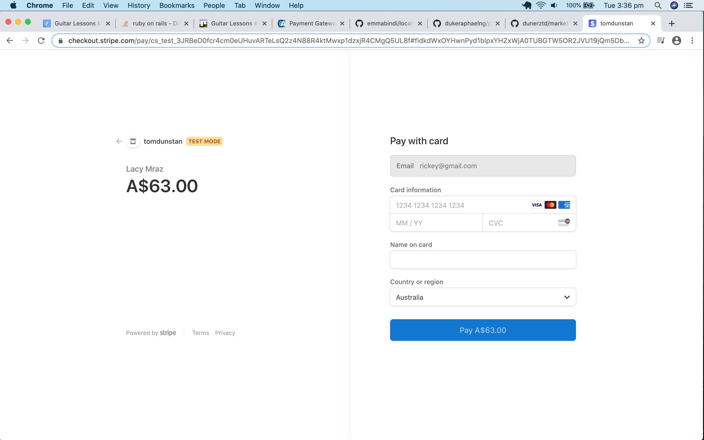
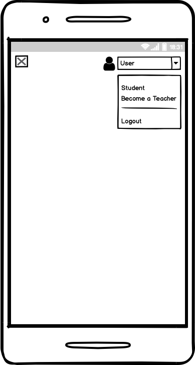
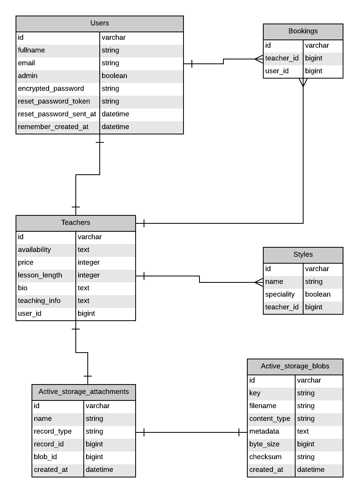

# T2A2 - Marketplace App

**Github:** https://github.com/dunerztd/marketplace_app

**Heroku:** https://marketplaceapp-guitar.herokuapp.com/

**Accounts:**
All accounts emails are the users first name + '@gmail.com' and '111111' as password.

---

## Problem
Finding a guitar teacher can be difficult when starting out or for when you have a particular style/skill in mind. As we are currently in isolation due to COVID-19, many people are fulfilling a long held wish to learn a musical instrument and are reaching for a guitar.
This marketplace app will give you the ability to find a guitar teacher based on a particular style you want to play with teachers listed by their specialty. As we are unable to be in close contact, the app will give students the ability to purchase lessons blocks and set up lessons over a webcam. This has the advantage of location not being a problem plus opening up the potential to find students/teachers anywhere in the globe.

---

## Description

### Purpose

The purpose of this marketplace is to connect guitar teachers with students looking to learn the guitar in a specific style and to conduct the lesson over a webcam.

### Functionality/Features

- Guests can look through teacher profiles to get a feel of whats on offer.
- People who want to purchase a lesson can sign up. The student view displays all the lessons which the user has paid for with details to contact the teacher.
- Teacher profiles can be filtered according to style and also specifically by a teachers style speciality.
- Students can purchase a lesson block through Stripe by a simple click from the profile page.
- The same user account combines both student and teacher capabilities. From the student view, clicking 'become a teacher' from the menu directs the user to a form. Information such as name, availability, price, lesson length, a biography and additional teacher information cna combined with a profile photo to complete the teacher profile.
- Upcoming teaching lessons are displayed in the teacher view along with links to view and edit their profile.

### Sitemap

### Screenshots

### Target Audience

The target audience for this marketplace is students wanting to learn the guitar in a specific style and teachers who are knowledgeable or experienced in a given style.

### Tech Stack

- **Front-end:** HTML, SCSS, Embedded Ruby, Javascript, jQuery, PopperJS, Bootstrap
- **Back-end:** Ruby, Ruby on Rails
- **Database:** Postgresql
- **Deployment:** Heroku
- **Storage:** AWS S3
- **Utilities:** Stripe, Devise, Ultrahook

---

## User Stories

### Guest

- As a Guest, I want to see if there are any guitar teachers who specialise in playing jazz so I can become a jazz guitarist.
- As a Guest, I want to compare all the teachers available so I can find the best price.
- As a Guest, I want to see what the site has to offer before I make an account.

### Student

- As a Student, I want to book in a guitar lesson so I can start learning guitar.
- As a Student, I want to see all my upcoming lessons so I can be prepared.
- As a Student, I want to know my payments details are secure so I can focus on my guitar lessons.
- As a Student, I want detailed information on all the teachers so I can make an informed decision.
- As a Student, I want a way to contact a teacher directly once a payment is made so we can set up a time to conduct the lesson.

### Teacher

- As a Teacher, I want to teach guitar so I can earn some income.
- As a Teacher, I want to create a profile which really informs my prospective students.
- As a Teacher, I want to add a photo of myself to my profile so my students can get to know me a little better.
- As a Teacher, I want to see all my upcoming lessons so I can plan my week.
- As a Teacher, I want to see to able to contact my students so we can set up a lesson or discuss any issues.

---

## Planning

I'll be using Trello to plan and track all my tasks. All tasks will be split up into different lists such as documentation, requirements etc to begin with. Once I start coding I'll add lists such tables, models, controllers, validations etc. All mandatory tasks as per the assignment outline are marked 'must do' and coloured red. Tasks I'm currently working are placed in the 'In Progress' list. Once finished they are moved to the 'Completed' list.

#### Plan Outline:

- Decide on app idea out of two competing ideas.
- Sketch out thoughts/ideas to get started.
- Test out the ideas I'm most keen on first to see if they were possible depending on time and skill level.
- Create rough idea of how users would navigate through the app (user stories to help with this), what each page will look like, what happens when a user clicks this or that button etc.
- Solidify this by creating the Wireframes and ERD.
- Finish all documentation (as much as possible) before start coding.
- This will leave roughly two weeks to complete the coding.
- Minimum Viable Product with minimal front-end is the coding aim. If time permits add extra functionality and/or improve front-end.

#### Trello Screenshots

---

## Wireframes

### Home

Full Size  |  Mobile
---------  |  --------
 | 

### Show

Full Size  |  Mobile
---------  |  --------
 | 

### Login

Full Size  |  Mobile
---------  |  --------
 | 

### Sign Up

Full Size  |  Mobile
---------  |  --------
 | 

### Student Navbar

Full Size  |  Mobile
---------  |  --------
 | 

### Student Page

Full Size  |  Mobile
---------  |  --------
 | 

### Student Show

Full Size  |  Mobile
---------  |  --------
 | 

### Teacher Navbar

Full Size  |  Mobile
---------  |  --------
 | 

### Teacher Page

Full Size  |  Mobile
---------  |  --------
 | 

### Teacher Profile Form

Full Size  |  Mobile
---------  |  --------
 | 

### Teacher Profile Edit Form

Full Size  |  Mobile
---------  |  --------
 | 

---

## ERD

---

## High Level Components

#### Student

In regards to a two sided marketplace, the student in this case is the buyer. To become a student, a user must sign up for an account with an email and password. All teacher profiles are listed on the home page and can be filtered according to style or styles using the form on the left hand side. Clicking on a profile shows the expanded teacher profile. The green 'purchase a lesson' button is how a student buys a lesson block and it's either 30 or 60 mins long. Lesson appointment times are to be worked out separately by the two parties. The student is taken to the Stripe checkout page and they enter their payments details and once its processed, a booking is made. All paid for lessons are viewable by clicking 'Student' from the main drop-down menu.

#### Teacher

The teacher is this two side marketplace is the seller. Using the same account as the student, clicking 'Become a Teacher' from the drop-down opens up a form to create a teacher profile. To complete the form, the user must fill out the whole form with information such as music styles, availability, price, lesson length, biography, teaching information and providing a profile photo. By selecting 'Teacher' from the main menu, this profile can be viewed, edited and deleted. All upcoming teacher lessons are listed in this view also.

#### Booking

A booking in this marketplace allows for a transaction between the student buyer and the teacher seller. Once a student commits to a purchase through Stripe, these real time details are sent back to the server through webhooks. A booking is created with information of both parties which allows access to both the student and teachers user details. Each others details of the booking show up their respective teacher and student views with information such as full name, email, lesson length and price. This allows the student and teacher to contact each other and set up a time for the guitar lesson.

---

## Model Relationships

#### User:
- has_one Teacher, a Teacher belongs_to a User
- has_many Bookings, a Booking belongs_to a User

In addition to these associations, a User can have one Teacher who can have many Styles, many Bookings and one Picture.
Through User association with Booking, Users can have many Bookings who can have a Teacher who has many Styles and one Image.

#### Teacher:
- belongs_to a User, a User has_one Teacher
- has_many Bookings, a Booking belongs_to a Teacher
- has_many Teachers_Style, Teachers_Style belongs_to Teacher
- has_many Styles through Teachers_Style, Styles has_many Teachers through Teachers_Style
- has_one_attached Picture

In addition to these associations, A Teacher has one User who has many Bookings and a Teacher has many Bookings who has one User.

#### Booking:
- belongs_to a User, a User has_many Bookings
- belongs_to a Teacher, a Teacher has_many Bookings

The Booking associations of being between the User and Teacher models is an important one to the app. It allows a single user account to be both a Teacher and Student. Through Bookings we can find out information on the student through the User association. But also through the Teacher association, we can find information on the User associated with the teacher profile.

#### Style:
- has_many Teachers_Styles, Teachers_Style belongs_to Teacher
- has_many Teachers through Teachers_style, a Style has_many Teachers through Teachers_Style

Through the Style models association with the Teacher model, a Style can have many Teachers who has one User and a Style can have many Teachers who has many Bookings who has one User. A Style can have many Teachers who has one Picture.

#### Teachers_Style:
- belongs_to a Teacher, a Teacher has_many Teachers_Styles
- belongs_to a Style, a Style has_many Teachers_Styles

Acts as join model between the Teacher and Style models to allow a many-to-many relationship.

---

## Database Relations

#### Users:
The users table contains the attributes id, fullname, email, admin, encrypted_password, reset_password_token, reset_password_set_at, remember_created_at as can be seen in the ERD. 'fullname' and 'email' attributes help with identifying the user. The boolean 'admin' if true, gives the uses access to everything in the app. The other attributes along with 'email' are used in the Devise gem.

#### Bookings:
The Bookings table contains the attributes id, teacher_id and user_id as seen in the ERD. The teacher_id and user_id are foreign keys of the Teachers and Users table respectively. This allows the Bookings table to be effectively a join table by giving access to the Users table but also the Users table through the Teachers table.

#### Teachers:
The teachers table contains the attributes id, availability, price, lesson_length, bio, teaching_info, style_id, user_id as seen in the ERD. Style_id and user_id are foreign keys of the the Style and User tables respectively. Even though its a one-to-one relationship between the User and Teacher tables, Teacher belongs_to User in reality. The remaining attributes are used in the creation of a teacher profile.

#### Styles:
The Styles table contains the attributes id, name and teacher_id as seen in the ERD. All the music styles are listed by 'name'. Teacher_id is the foreign key for the one-to-many relationship with the Teacher table.

#### Teachers_Styles:
The Teachers_Styles table contains the attributes id, teacher_id, style_id and speciality as seen in the ERD. Teacher_id and style_id are foreign keys of the Teacher and Style Tables as Teachers_Styles is a join table for the many-to-many relationship between the two. The 'speciality' boolean attribute marks one style per profile 'true' which helps with filtering profiles by speciality. This helps with normalisation as a separate table purely for speciality styles is not needed.

#### Active_storage_attachments and Active_storage_blobs:
All the attributes of these two tables are for adding an image to the teacher profile and are automatically generated my Active Storage.

---

## Database Schema

**Active Storage Attachments**
- name: string, null: false
- record_type: string, null: false
- record_id: bigint, null: false
- blob_id: bigint, null: false
- created_at: datetime, null: false

**Active Storage Blobs**
- key: string, null: false
- filename: string, null: false
- content_type: string
- metadata: text
- byte_size: bigint, null: false
- checksum: string, null: false
- created_at: datetime, null: false

**Bookings**
- user_id: bigint, null: false
- teacher_id: bigint, null: false
- created_at: datetime, null: false
- updated_at: datetime, null: false

**Styles**
- name: string
- created_at: datetime, null: false
- updated_at: datetime, null: false

**Teachers**
- availability: text
- price: integer
- lesson_length: integer
- bio: text
- teaching_info: text
- user_id: bigint, null: false
- created_at: datetime, null: false
- updated_at: datetime, null: false

**Teachers Styles**
- teacher_id: bigint, null: false
- style_id: bigint, null: false
- created_at: datetime, null: false
- updated_at: datetime, null: false
- speciality: boolean, default: false

**Users**
- email: string, default: "", null: false
- encrypted_password: string, default: "", null: false
- reset_password_token: string
- reset_password_sent_at: datetime
- remember_created_at: datetime
- created_at: datetime, null: false
- updated_at: datetime, null: false
- fullname: string
- admin: boolean, default: false

---

## Third Party Services

**Bootstrap:** Front-end framework for HTML, CSS and Javascript. Design templates for layouts, buttons, forms and other components.

**jQuery-rails:** Javascript library used by Bootstrap.

**jQuery-turbolinks:** Javascript library used by Bootstrap.

**PopperJS:** Javascript library positioning engine used by Bootstrap. Will be used for the drop-down menu.

**Devise:** A rails gem for user authentication. Creates a simple solution for users to sign-up and login with an email address and encrypted password.

**Stripe:** Payment processing software for online payments.

**Ultrahook:** Enables webhooks to be received behind a firewall. Provides information back to the web app when a Stripe payment is made.

**AWS S3:** Provides cloud data storage. Used in conjunction with Active Storage to upload images for teacher profiles.

**Faker:** Generates fake data for populating databases and aids in application development.

**Ultrahook:** A webhook API which can be used in development on a local host. Used in conjunction with Stripe to receive real-time information back to the app.